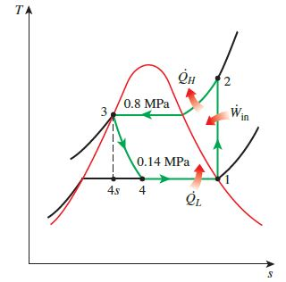
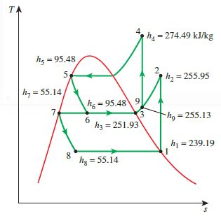

# SimVCCE

**Branch 3** 

The SimVCCE is the vapor-compression refrigeration and heat pump cycle steady-state simulator for education.

The simulator is available in Python, C++ with sequential-modular approach

*  [Python Package](./simvcce)
*  [The Web Server with Flask](./webservice/)
*  [C++](./vcccpp)

We wish that SimVCCE may be a helpful vehicle for you to understand the object-oriented programming and improve programming skills

---
 
- [SimVCCE](#simvcce)
  - [Install simvcce](#install-simvcce)
  - [Examples of using SimVCCE package](#examples-of-using-simvcce-package)
  - [Using Remote Web Service](#using-remote-web-service)
  - [The Vapor-Compression Cycle Examples](#the-vapor-compression-cycle-examples)
    - [1 The Ideal Vapor-Compression Refrigeration Cycles](#1-the-ideal-vapor-compression-refrigeration-cycles)
    - [2 Performance Analysis of VCR cycle under Variable Conditions](#2-performance-analysis-of-vcr-cycle-under-variable-conditions)
    - [3 Multistage Compression Refrigeration](#3-multistage-compression-refrigeration)

## Install simvcce

```
python -m pip install simvcce
```

## Examples of using SimVCCE package 

* [./vccpython/](./vccpython/) 

## Using Remote Web Service 

* https://simvcce.herokuapp.com/simvcce 

In the terminal of ./webservice/

```bash
curl  https://simvcce.herokuapp.com/simvcce -d @./jsonmodel/ivcr_11_1.json --header "Content-Type: application/json"
```

## The Vapor-Compression Cycle Examples

Yunus A. Cengel, Michael A. Boles,Thermodynamics: An Engineering Approach, 8th Edition, McGraw-Hill.2015

### 1 The Ideal Vapor-Compression Refrigeration Cycles

EXAMPLE 11–1 The Ideal Vapor-Compression Refrigeration  Cycle

A refrigerator uses R134a as the working fluid and operates on an ideal vapor-compression refrigeration cycle between 0.14 and 0.8 MPa.

If the mass flow rate of the refrigerant is 0.05 kg/s, 

**Determine** 

* (a) the rate of heat removal from the refrigerated space and the power input to the compressor,
* (b) the rate of heat rejection to the environment, and 
* (c) the COP of the refrigerator.



### 2 Performance Analysis of VCR cycle under Variable Conditions

```
./vccpython/vccapp_json_one_var.py
```
The ideal vapor-compression refrigeration cycle of [Vapor-compression refrigeration simulation and tutorial](https://peer.asee.org/vapor-compression-refrigeration-simulation-and-tutorial.pdf)

* the evaporator pressure is maintained constant at 0.12MPa
* the mass flow rate of refrigerant is 1 kg/s.

**Variable conditions**

* **refrigerants**: R12,R134a,R22

* **condenser pressures**:0.4, 0.5, 0.6, 0.7, 0.8, 0.9,0.1, 1.4 MPa.

**Analysis**

Calculate the COP of the ideal vapor-compression refrigeration cycle 

* **Save** the results to the csv file

* **Plot** the COPs against the condenser pressure

### 3 Multistage Compression Refrigeration 

EXAMPLE 11–5 A Two-Stage Refrigeration Cycle with a Flash Chamber

Consider a two-stage compression refrigeration system operating between the pressure limits of 0.8 and 0.14 MPa. The working fluid is  R134a.
The refrigerant leaves the condenser as a saturated liquid and is throttled to a flash chamber operating at 0.32 MPa. 

Part of the refrigerant evaporates during this flashing process, and this vapor is mixed with the refrigerant leaving the low-pressure compressor. 

The mixture is then compressed to the condenser pressure by the high-pressure compressor. 

The liquid in the flash chamber is throttled to the evaporator pressure and cools the refrigerated space as it vaporizes in the evaporator. 

Assuming the refrigerant leaves the evaporator as a saturated vapor and both compressors are isentropic,

**Determine**

* (a) the fraction of the refrigerant that evaporates as it is throttled to the flash chamber,
* (b) the amount of heat removed from the refrigerated space and the compressor work per unit mass of refrigerant flowing through the condenser, and
* (c) the coefficient of performance.




