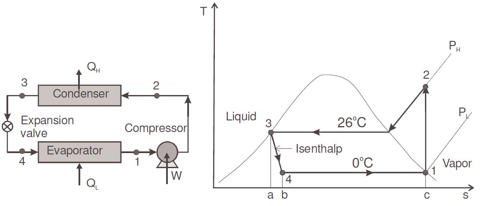
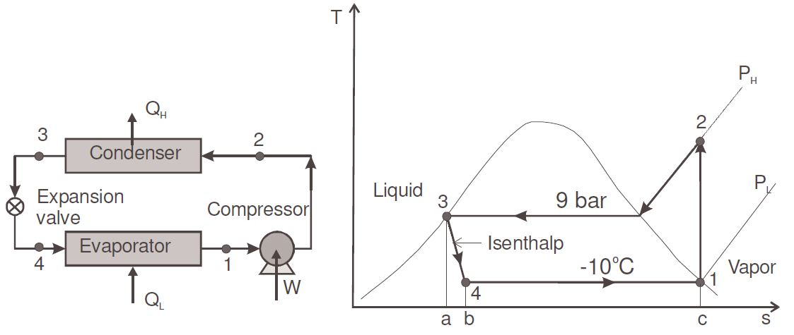
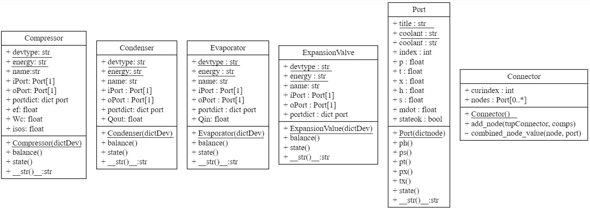
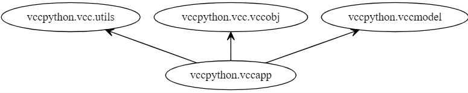

# SimVCCE

The SimVCCE is the vapor-compression refrigeration cycle steady-state simulator for education.

The simulator is available in Python, C++ and Modelica

* branch: **B2022**`:  [Python code of sequential-modular approach](./vccpython)

* branch **sm-port-conn**:  [Python, C++ and Modelica](/tree/sm-port-conn/)


We wish that SimVCCE may be a helpful vehicle for you to  understand Computational Thinking and improve programming skills

### Prerequisites：CoolProp

```bash
python -m pip install coolprop
```
### Run
 
#### Using the Python Module for the Cycle Flowsheet and Data

type `python vccapp.py` in the terminal of `./vccpython` 

```bash
python  vccapp.py
```
#### Using JSON File for the Cycle Flowsheet and Data

type `python  vccapp_json.py` in the terminal of `./vccpython` 

```bash
python  vccapp_json.py
```

## The Example vapor-compression refrigeration cycles

The cycles used in the demo simulator are Example 7.2-3,7.2-4 of [CHE 302 Chemical and Materials Engineering Thermodynamics I](https://www.cpp.edu/~tknguyen/che302/) by Thuan Ke Nguyen 

* [Example 7.2-3,7.2-4](https://www.cpp.edu/~tknguyen/che302/Notes/chap7-2.pdf)
 
### Example 7.2-3

Refrigerant 134a is the working fluid in an ideal vapor-compression refrigeration cycle that communicates thermally with a cold region at 0°C and a warm region at 26°C.

Saturated vapor enters the compressor at 0°C and saturated liquid leaves the condenser at 26°C.

The mass flow rate of the refrigerant is 0.08 kg/s.



### Example 7.2-4

Refrigerant 134a is the working fluid in an ideal vapor-compression refrigeration cycle that communicates thermally with a cold region at - 10°C.

Saturated vapor enters the compressor at - 10°C and saturated liquid leaves the condenser at 9 bar. 

The mass flow rate of the refrigerant is 0.08 kg/s.



### Determine

 * (a) the compressor power, in kW
 
 * (b) the refrigeration capacity, in tons
 
 * (c) the coefficient of performance

## The UML Diagrams

### components package




### vcc package


### vccapp



## The flowchart of the cycle analysis


## Reference:

* [Creating UML diagrams for Python code with Pyreverse](https://gitee.com/thermalogic/sees/blob/S2019/guide/UMLPython.md)


