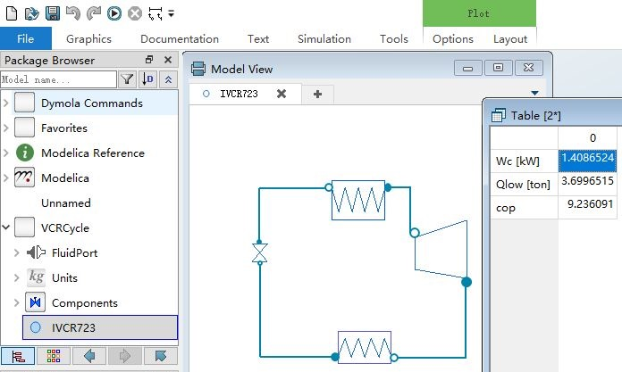

# SimVCCE

The SimVCCE is the vapor-compression refrigeration cycle steady-state simulator for education. The educational simulator is available in Python, C++ and Modelica

* [Python](./vccpython)

* [C++](./vcccpp)

* [Modelica](./vccmo)

We wish that SimVCCE may be a helpful vehicle for you to understand

*  Computational Thinking and improve programming skills

*  Modeling and Simulation Methods for Design of Engineering Systems

## Python Version

### Prerequisites：CoolProp

```bash
python -m pip install coolprop
```
### Run
 
type `python  vccapp.py` in the terminal of `./vccpython` 

```bash
python  vccapp.py
```

## C++ Version

### Prerequisites：The shared library of CoolProp

* `libCoolProp.dll` is the library builded with tdm64-gcc-9.2.0 on Windows 

* `libCoolProp.so.6.4.1`  is the library builded with GCC 9.3 and glibc2.29 above on Linux

### Install the CoolProp on Linux 

type `sudo make install` in the terminal of `./vcccpp` on Linux

```bash
$sudo make install
```

### Build and Run

type `make` in the terminal of `./vcccpp`

```bash
>make
```

## Modelica Version

**Prerequisites**：Dymola



## The Example vapor-compression refrigeration cycles

The cycles used in the demo simulator are Example 7.2-3,7.2-4 of [CHE 302 Chemical and Materials Engineering Thermodynamics I](https://www.cpp.edu/~tknguyen/che302/home.htm) by Thuan Ke Nguyen 

* [Example 7.2-3,7.2-4](https://www.cpp.edu/~tknguyen/che302/Notes/chap7-2.pdf)
 
### Example 7.2-3

Refrigerant 134a is the working fluid in an ideal vapor-compression refrigeration cycle that communicates thermally with a cold region at 0°C and a warm region at 26°C.

Saturated vapor enters the compressor at 0°C and saturated liquid leaves the condenser at 26°C.

The mass flow rate of the refrigerant is 0.08 kg/s.


### Example 7.2-4

Refrigerant 134a is the working fluid in an ideal vapor-compression refrigeration cycle that communicates thermally with a cold region at - 10°C.

Saturated vapor enters the compressor at - 10°C and saturated liquid leaves the condenser at 9 bar. 

The mass flow rate of the refrigerant is 0.08 kg/s.


### Determine

 * (a) the compressor power, in kW
 
 * (b) the refrigeration capacity, in tons
 
 * (c) the coefficient of performance

