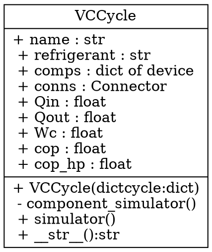
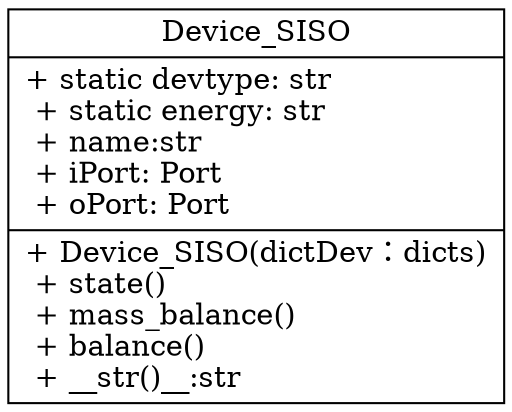
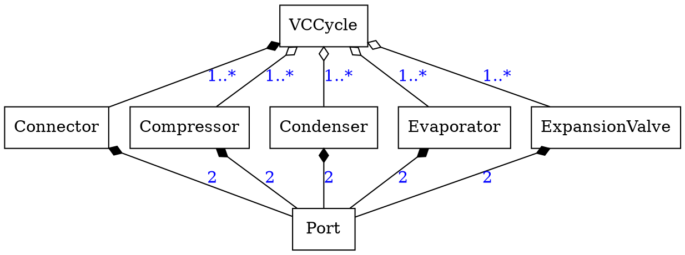
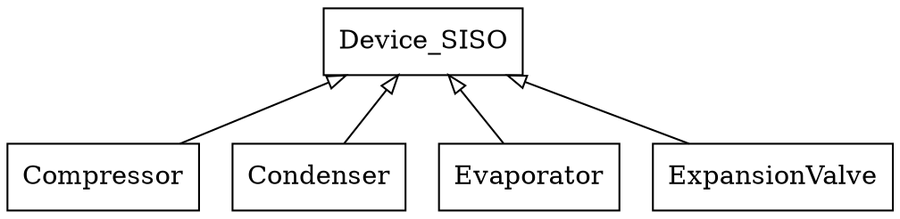
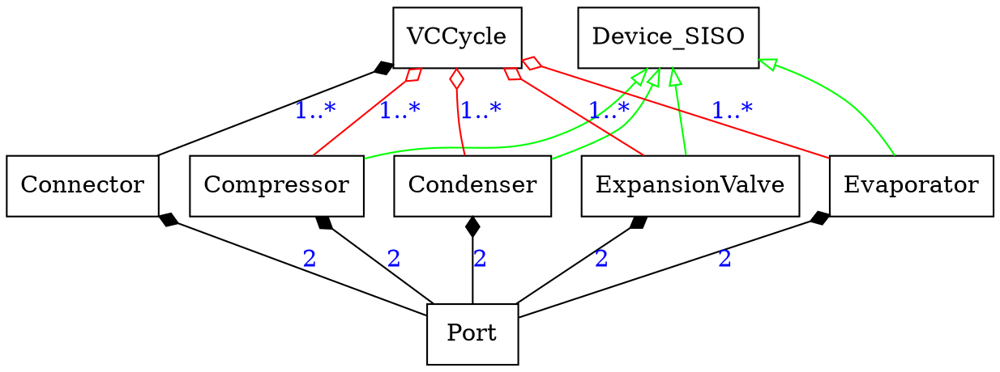

# Class Diagrams of VCCE in Dot

- [Class Diagrams of VCCE in Dot](#class-diagrams-of-vcce-in-dot)
  - [Class Method or Field](#class-method-or-field)
    - [Visibility](#visibility)
    - [Scope](#scope)
  - [Class and Instance Relations](#class-and-instance-relations)
    - [Instance Relations](#instance-relations)
    - [Class Relation](#class-relation)
    - [Class and Instance Relations](#class-and-instance-relations-1)

## Class Method or Field

### Visibility

When you define methods or fields, you can use **characters** to define the **visibility** of the corresponding item:

| Character | Visibility |
| --------- | :--------: |
| -         |  private   |
| +         |  public   |
  

### Scope

The UML specifies two types of scope for members: `instance and class`

You can define **class**  methods or fields using the **static**

##  Class and Instance Relations

### Instance Relations

* Composition： a filled diamond shape (diamond)
* Aggregation： a filled diamond shape (odiamond)

### Class Relation
 
* Inheritance： a hollow triangle shape(empty)

### Class and Instance Relations

