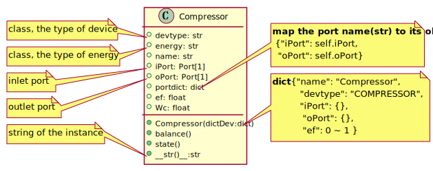
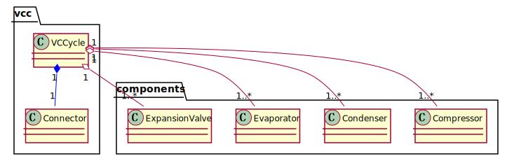
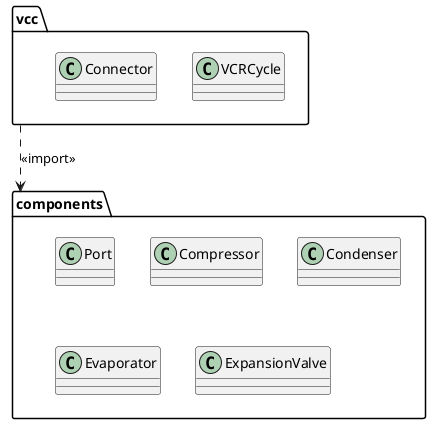

# PlantUML Class Diagrams

- [PlantUML Class Diagrams](#plantuml-class-diagrams)
  - [1 Class Compressor](#1-class-compressor)
  - [2 The Composition Relation](#2-the-composition-relation)
  - [3 The Aggregation Relation](#3-the-aggregation-relation)
  - [4 Package](#4-package)

## 1 Class Compressor

When you define methods or fields, you can use **characters** to define the **visibility** of the corresponding item:

| Character  | Visibility  |
| ---------- |:-----------:| 
| -          | private     |
| +          | public      | 
  
You can define static(class)  methods or fields using the `{static}`

```puml
class Compressor {
 + {static} devtype: str
 + {static} energy: str
 + name: str
 + iPort: Port[1]
 + oPort: Port[1]
 + portdict: dict
 + ef: float
 + Wc: float
 + {static} Compressor(dictDev:dict)
 + balance()
 + state()
 + __str()__:str
}
note left of Compressor::devtype
  class, the type of device
end note
note left of Compressor::energy
  class, the type of energy
end note
note left of Compressor::iPort
  inlet port
end note
note left of Compressor::oPort
  outlet port
end note
note left of Compressor::__str()__
  string of the instance
end note
note right of Compressor::portdict
  **map the port name(str) to its obj**
   {"iPort": self.iPort,
    "oPort": self.oPort}
end note
note right of Compressor::Compressor(dictDev:dict)
  **dict** {"name": "Compressor",
            "devtype": "COMPRESSOR",
            "iPort": {},
             "oPort": {},
             "ef": 0 ~ 1 }
end note
```



## 2 The Composition Relation 

The Composition Relation is  defined using the following symbol:

```
*-- 
```
For cardinality, you can use double-quotes `" "` on each side of the relation.

It is possible to add a label on the relation, using `:`, followed by the text of the label.

The Composition relation of Compressor and Port's instance 

```puml
class Compressor{
  + iPort : Port[1]
  + oPort : Port[1]
}
Compressor "1" *-- "2" Port 
```


## 3 The Aggregation Relation 

The Aggregation Relation is  defined using the following symbol:

```
o-- 
```

The Aggregation and Compositionrelation of VCR Cycle and it's components 

```puml
vcc.VCRCycle "1" *-[#blue]- "1" vcc.Connector 
vcc.VCRCycle "1" o-- "1" components.Compressor 
vcc.VCRCycle "1" o-- "1" components.Condenser
vcc.VCRCycle "1" o-- "1" components.Evaporator
vcc.VCRCycle "1" o-- "1" components.ExpansionValve
```




## 4 Package



