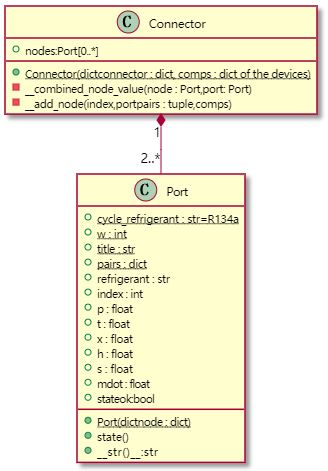

# The UML Class Diagrams

- [The UML Class Diagrams](#the-uml-class-diagrams)
  - [The Port and Connector class](#the-port-and-connector-class)
  - [The Component class](#the-component-class)
  - [The VCCycle Class](#the-vccycle-class)
  - [The Flowchart of the cycle analysis](#the-flowchart-of-the-cycle-analysis)

<!-- /TOC -->
## The Port and Connector class  

## The Component class

## The VCCycle Class

## The Flowchart of the cycle analysis

