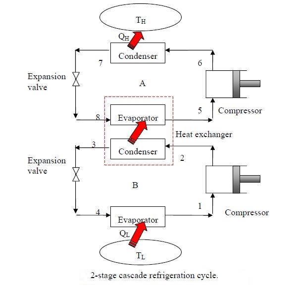

# Playground 

## 1 Cascade Refrigeration Cycle

The Cascade system  have 2 (or more) refrigeration cycles operating in series.

Th eCascade cycle is used where a very wide range of temperature between `TL` and `TH `is required. 

As shown in the Fig, the `condenser` for the `low` temperature refrigerator is used as the `evaporator` for the `high` temperature refrigerator

Consider a two-stage cascade refrigeration system operating between pressure limits of `0.8` and `0.14` MPa.

Each stage operates on an ideal vapor-compression refrigeration cycle
with refrigerant `R-134a` as working fluid. 

`Heat rejection` from the `lower` cycle to the `upper` cycle takes place in an adiabatic counter flow heat exchanger where both streams enter at
about `0.32` MPa.

If the mass flow rate of the refrigerant through the `upper` cycle is `0.05`
kg/s,

**Determine**

* a) the mass flow rate of the refrigerant through the lower cycle
* b) the rate of heat removal from the refrigerated space
* c) the power input to the compressor
* d) COP

## 2 Performance Analysis of VCR cycle under Variable Conditions

* [ivcrvar.json](./jsonmodel/ivcrvar.json) 

* demo_vccapp_json_var.py

The ideal vapor-compression refrigeration cycle of [Vapor-compression refrigeration simulation and tutorial](https://peer.asee.org/vapor-compression-refrigeration-simulation-and-tutorial.pdf)

* the evaporator pressure is maintained constant at 0.12MPa
* the mass flow rate of refrigerant is 1 kg/s.

**Variable conditions**

* **refrigerants**: R12,R134a,R22

* **condenser pressures**:0.4, 0.5, 0.6, 0.7, 0.8, 0.9,0.1, 1.4 MPa.

**Analysis**

Calculate the COP of the ideal vapor-compression refrigeration cycle 

* **Save** the results to the csv file

* **Plot** the COPs against the condenser pressure

## 3. The Home Heat Pump for Space Heating

The Cycle of [A Home Heat Pump for Space Heating](https://www.ohio.edu/mechanical/thermo/Intro/Chapt.1_6/refrigerator/heatpump.html)

The heat pump system absorbs heat from the evaporator placed outside in order to pump heat into the air flowing through the insulated duct over the condenser section

In this example, we evaluate the following:

**The Heat Pump**

* Heat absorbed by the evaporator: Qin

* Heat rejected by the condenser: Qout

* Coefficient of Performance as a heat pump:COP_hp

* Determine the **mass** flow rate of the refrigerant R134a

**The Insulated Duct**

* Determine the **mass** flow rate of the air flowing in the insulated duct

* Assuming that all this heat is absorbed by the air, determine the exit **temperature** of the air at station

