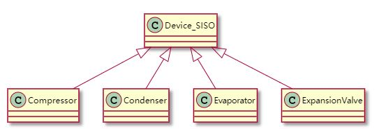
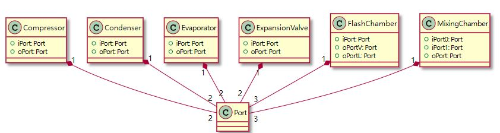
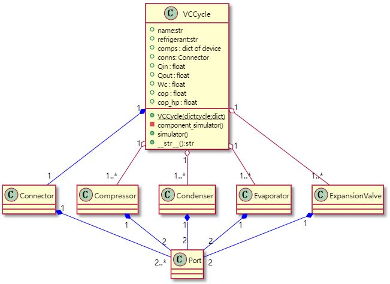

# UML Class Diagrams of VCCE

- [UML Class Diagrams of VCCE](#uml-class-diagrams-of-vcce)
  - [Port and Connector Class](#port-and-connector-class)
  - [Component Classes](#component-classes)
    - [Class Device_SISO](#class-device_siso)
    - [Class Inheritance Relation of Device_SISO and Components](#class-inheritance-relation-of-device_siso-and-components)
    - [Instance Relation of Components and Port](#instance-relation-of-components-and-port)
  - [Class VCCycle](#class-vccycle)
    - [Class VCCycle and Instance Relations](#class-vccycle-and-instance-relations)
    - [Class and Instance Relations of Classes](#class-and-instance-relations-of-classes)
    - [Flowchart of VC Cycle Analysis](#flowchart-of-vc-cycle-analysis)

<!-- /TOC -->
## Port and Connector Class  

## Component Classes

### Class Device_SISO 

### Class Inheritance Relation of Device_SISO and Components

### Instance Relation of Components and Port

## Class VCCycle

### Class VCCycle and Instance Relations

### Class and Instance Relations of Classes

### Flowchart of VC Cycle Analysis

